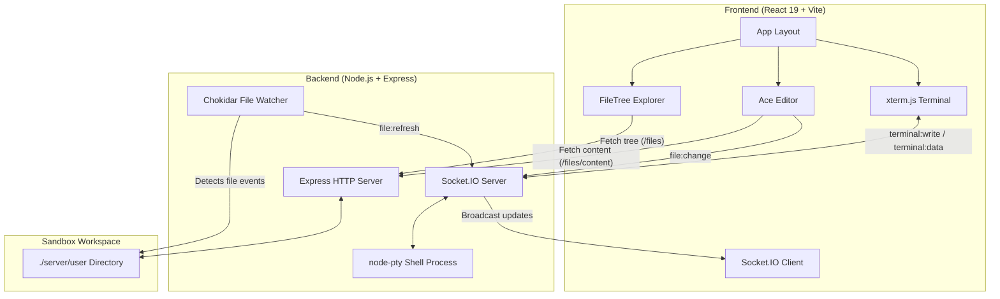

# ⚡ Web Code Editor & Integrated Terminal

A modern, cloud-inspired browser IDE that provides an interactive code editor, real-time file tree explorer, and a full-featured pseudo-terminal (PTY) connected directly to your shell.

---

## 🌟 Features

- 📂 **Interactive File Tree Explorer**
  - Hierarchical visualization of directories and files in the workspace.
  - Collapsible/expandable folders with state preservation.
  - Language-specific color-coded icons for `.js`, `.jsx`, `.ts`, `.tsx`, `.css`, `.html`, `.json`, `.py`, `.md`, `.sql`, and more.
  - Real-time updates synchronized across all changes via Socket.IO & Chokidar.

- 📝 **Powerful Code Editor**
  - Powered by **Ace Editor** with the sleek `tomorrow_night` dark theme.
  - Smart code features: live autocompletion, syntax highlighting, indent guides, and snippet expansion.
  - Auto-saving: changes are debounced and synced to disk automatically after 2 seconds.
  - Real-time saved/unsaved file status indicator and breadcrumb path header.

- 💻 **Integrated Web Terminal (PTY)**
  - Full terminal emulation powered by **`@xterm/xterm`** in the frontend and **`node-pty`** on the backend.
  - Interactive shell: spawns **WSL Bash** on Windows (with automatic fallback to PowerShell) or Bash on Linux/macOS.
  - True bidirectional streaming: executes commands, renders ANSI colors, and supports interactive CLI tools.
  - Dynamic responsive resizing: terminal cols/rows adapt automatically to browser window resizing.

- 🛡️ **Secure Workspace Sandboxing**
  - Path normalization & traversal protection (`getSafeUserPath`) prevents unauthorized filesystem access outside the target `user/` folder.
  - Automatic directory creation and isolated user workspace.

---

## 🏗️ Architecture



---

## 🗂️ Project Structure

```text
Code Editor/
├── frontend/                     # React + Vite client
│   ├── public/                   # Static assets
│   ├── src/
│   │   ├── components/
│   │   │   ├── Terminal.jsx      # xterm.js terminal integration
│   │   │   └── Tree.jsx          # File tree navigation component
│   │   ├── App.css               # IDE layout & styling
│   │   ├── App.jsx               # Main editor application logic
│   │   ├── index.css             # Base stylesheet
│   │   ├── main.jsx              # React application root
│   │   └── socket.js             # Socket.IO client instance
│   ├── index.html
│   ├── package.json
│   └── vite.config.js
│
├── server/                       # Express + Socket.IO backend
│   ├── user/                     # Sandboxed workspace for user files
│   ├── index.js                  # Server entry, PTY process & APIs
│   ├── package.json
│   └── package-lock.json
│
└── README.md                     # Documentation
```

---

## 🚀 Getting Started

### Prerequisites

Ensure you have the following installed:
- [Node.js](https://nodejs.org/) (v18.0.0 or higher recommended)
- [npm](https://www.npmjs.com/)
- *(Optional on Windows)* [WSL (Windows Subsystem for Linux)](https://learn.microsoft.com/en-us/windows/wsl/install) for full Linux Bash terminal support (defaults to PowerShell if WSL is not found).

---

### Installation

1. **Clone the repository:**
   ```bash
   git clone <repository-url>
   cd "Code Editor"
   ```

2. **Install backend dependencies:**
   ```bash
   cd server
   npm install
   ```

3. **Install frontend dependencies:**
   ```bash
   cd ../frontend
   npm install
   ```

---

### Running the Application

For the best development experience, run both the backend server and frontend client in separate terminal windows:

#### 1. Start the Backend Server
```bash
cd server
npm run dev
```
The server will start listening on `http://localhost:9000`.

#### 2. Start the Frontend Development Server
```bash
cd frontend
npm run dev
```
Open your browser and navigate to the displayed local URL (typically `http://localhost:5173`).

---

## 📡 API Reference

### HTTP Endpoints

| Method | Endpoint | Query / Body Params | Description |
|---|---|---|---|
| `GET` | `/files` | _None_ | Returns the hierarchical tree structure of the `user/` folder. |
| `GET` | `/files/content` | `?path=<relative_path>` | Retrieves the UTF-8 text content of a specified file. |
| `POST` | `/files/create` | `{ path: string, isDir: boolean }` | Creates a new file or directory inside the workspace. |
| `DELETE` | `/files` | `?path=<relative_path>` | Deletes a file or directory recursively. |

---

### Socket.IO Real-Time Events

#### Client → Server
| Event | Payload | Description |
|---|---|---|
| `file:change` | `{ path: string, content: string }` | Saves updated file content to the disk. |
| `terminal:write` | `string` | Forwards user keystrokes and input to the active PTY shell process. |
| `terminal:resize`| `{ cols: number, rows: number }` | Dynamically updates the PTY terminal window dimensions. |

#### Server → Client
| Event | Payload | Description |
|---|---|---|
| `file:refresh` | `[filePath]` | Alerts the frontend that files have changed, triggering a tree refresh. |
| `file:saved` | `{ path: string }` | Confirms that a file has been successfully written to disk. |
| `terminal:data` | `string` | Streams raw terminal output from the shell process into `xterm.js`. |

---

## 🛠️ Built With

- **Frontend:**
  - [React 19](https://react.dev/)
  - [Vite](https://vitejs.dev/)
  - [Ace Editor](https://ace.c9.io/) via [react-ace](https://github.com/securingsw/react-ace)
  - [@xterm/xterm](https://xtermjs.org/)
  - [Socket.IO Client](https://socket.io/docs/v4/client-api/)

- **Backend:**
  - [Node.js](https://nodejs.org/) & [Express 5](https://expressjs.com/)
  - [Socket.IO](https://socket.io/)
  - [node-pty](https://github.com/microsoft/node-pty) (Pseudo-terminal bindings)
  - [Chokidar](https://github.com/paulmillr/chokidar) (Cross-platform file watcher)
  - [Nodemon](https://nodemon.io/)

---

## 📄 License

This project is licensed under the [ISC License](LICENSE).
